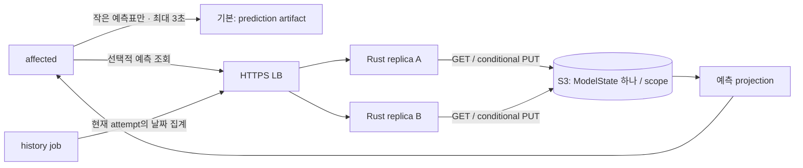

# 선택적 Rust 예측 상태 서버 — OpenAPI / S3 / 분산 실행

상태: **설계 문서이며 runtime 미구현**. 기본 GitHub artifact 방식은 서버 없이 동작한다. 이 서버는 원본 실행 이력을 보관하는 서비스가 아니라 다음 CI의 **작은 예측 상태**를 제공한다. 데이터/알고리즘의 기준은 [PredictionState v3](prediction-model-spec.md), HTTP 계약은 [OpenAPI 3.1.1](api/history.openapi.yaml), 구현 순서는 [전체 계획](../IMPLEMENTATION_PLAN.md)이다.

## 1. Rust 선택과 책임

Rust + Axum + Tokio + AWS SDK for Rust를 사용한다. Nanoom의 Rust/Serde/Tokio 기반과 집계·예측·검증 코드를 공유할 수 있다는 이유이며, 언어 성능 우위를 측정했다고 주장하지 않는다. 구현 시 별도 workspace package/binary `nanoom-history-server`를 `crates/history-server`에 추가한다. server dependencies는 CLI binary에 포함시키지 않는다. pure prediction 모듈만 공유한다. 지금 Cargo나 서버 코드는 만들지 않는다.

서버는 aggregate batch를 반영하고 예측값을 읽는 기능만 제공한다. 작업 실행, task DAG, queue/lease/heartbeat, remote cache, workflow 성공 판단은 담당하지 않는다. 기존 `scheduler:http`의 `/v1/runs/...` live coordinator와 URL·token·계약을 분리한다.



## 2. 데이터와 Action 연결

- public 읽기는 PredictionTable v3의 `[keyId,estimatedMs,observationCount,lastObservedAtMs,validUntilMs]` rows만 반환한다. 원본 sample, 날짜 bucket, receipt, command, per-execution SHA를 planner에 보내지 않는다.
- ModelState v3는 최대 7개의 **날짜별 count/sum**과 파생 예측값, 짧은 batch receipt를 저장한다. 정확한 원본 sample 7개/128 MiB History v2 제안은 폐기한다. 아직 배포되지 않은 설계 변경이므로 HTTP `/v1`은 유지한다.
- `scheduler: artifact`에서 `historyBackend: artifact | server`를 선택하며 기본은 artifact다. 다른 scheduler와 server backend 조합은 설정 오류다. `historyServerUrl`, `historyRepositoryKey`, secret 환경변수 `NANOOM_HISTORY_TOKEN`을 사용한다.
- 실행 계획은 어느 backend에서도 artifact로 전달한다. runner의 측정 artifact는 1일 보관, history job이 성공 실행 ID를 dedup해 scope/run/attempt별 불변 집계 batch를 한 번 확정한다. server token은 runner task job에 배포하지 않는다.
- affected는 같은 PR/branch scope의 prediction, 없으면 신뢰하는 base branch prediction을 조회한다. push는 같은 branch push scope만 사용한다. 서버가 다른 scope를 자동 탐색하지 않는다.
- **planning의 전체 이력 lookup/다운로드/해석 예산은 기본 3초**다. metadata·재시도도 포함한다. prediction JSON은 8 MiB를 넘기지 않는다. 초과·장애는 바로 warning/cold로 전환하고 task를 진행한다. 긴 서버 write timeout을 planner read에 재사용하지 않는다.
- history job의 write만 최대 3회/전체 60초/요청당 25초, full jitter 0~2초, Retry-After 우선으로 retry한다. retry 대상은 불명 network 결과·429·503뿐이다. 401/403/404/409/413/415/422는 반복하지 않는다. 원래 body bytes/Idempotency-Key를 재사용한다.
- 이력 실패는 최적화 품질 저하이며 task 정확성 실패가 아니다. 계획 검증 실패·task 실패·affected base SHA 선택 실패는 그대로 fatal이다. 다른 backend에 조용히 dual-write하지 않는다.

## 3. HTTP와 권한

| Endpoint | 권한 | 결과 |
|---|---|---|
| `GET /health` | 없음 | 200, storage I/O 없는 liveness |
| `GET /ready` | 없음 | background probe 상태에 따라 200/503 |
| `GET /v1/repositories/{repositoryKey}/scopes/{scopeId}/snapshot` | exact scope read | compact PredictionTable 200 / 304 / 유효 row 없음 404 |
| `POST /v1/repositories/{repositoryKey}/scopes/{scopeId}/observations:merge` | exact scope write | aggregate 반영 또는 같은 batch 재시도의 200 receipt |

API `/v1`, Plan v1, ModelState/PredictionTable v3는 독립 버전이다. unknown/duplicate JSON object key, invalid Unicode, 압축 request body를 거부한다. UTF-8 JSON만 사용한다. 오류는 RFC9457 `application/problem+json`이며 code/requestId와 비밀을 포함하지 않는 detail을 제공한다. 401에는 Bearer challenge, 429/503에는 Retry-After를 넣는다. 304에는 body가 없다.

HTTP ETag는 **그 시점의 prediction projection bytes** SHA-256이다. S3 ETag나 전체 학습 모델 digest를 외부 ETag로 쓰지 않는다. 만료 bucket을 제외한 projection을 먼저 계산한 뒤 If-None-Match를 검사한다. 유효 row가 없으면 matching ETag라도 404이며 client는 cache를 무효화한다. GET projection 변경은 S3 write나 lifecycle 연장을 발생시키지 않는다.

### Scope

repositoryKey는 operator registry가 GitHub API origin + numeric repository ID에 매핑하는 별칭이다. GitHub.com/GHES의 숫자 ID 충돌을 피한다. body에서 bucket/prefix/endpoint를 받지 않는다.

Scope = repositoryKey/workflowPath/ref/group/taskRunner/timingEnvironment. ref는 push full branch ref 또는 PR 번호/head repository ID/head ref/base ref다. scopeId는 RFC8785 JCS(Scope)의 SHA-256이며 별도 Unicode normalization은 없다. raw branch/path를 S3 key에 직접 이어 붙이지 않는다. URL/body scope 일치와 key 형식을 검증한다. Key ID는 공용 compiler가 계산하며 서버는 인증된 writer의 집계 주장을 받는다. request의 event/run 필드 자체가 GitHub 서명 증거는 아니다.

### 인증

v1은 exact scope read/write allowlist를 가진 opaque bearer credential을 쓴다. operator auth file에 principal ID/token SHA-256/허용 repository와 scope ID를 둔다. 32 random bytes 이상의 raw token은 secret manager에서 주입하고 constant-time compare를 사용한다. wildcard scope는 없다. TLS LB 뒤에서 실행하며 localhost 개발만 HTTP를 허용한다.

무효 token은 401, 권한 밖 scope는 객체 존재와 관계없이 403이다. storage I/O 전에 권한을 확인한다. write-only principal에는 prediction/model 본문을 돌려주지 않는다. PR credential에는 main write 권한을 넣지 않고 main write token을 PR 코드에 전달하지 않는다. fork PR은 credential 없이 artifact/cold를 사용한다. exact scope별 credential 발급 부담은 v1 한계로 남긴다. OIDC 자동 발급/UI/tenant 관리 시스템은 추가하지 않는다.

## 4. S3 모델 저장과 동시 갱신

```text
<prefix>/prediction-state/v3/repositories/<repositoryKey>/scopes/<scopeId>/model.json
<prefix>/probes/<replica-boot-id>/<probe-id>
```

모든 replica는 같은 region/bucket/endpoint/prefix를 사용한다. scope당 하나의 객체에 stats와 receipt를 함께 저장한다. DB, Redis, leader, 별도 latest pointer/event log를 두지 않는다. 동일 region multi-AZ는 가능하지만 비동기 cross-region active-active는 지원하지 않는다. DR 시 writer를 한 region으로 제한한다.

저장소는 strong read-after-write와 conditional PUT을 만족해야 한다. AWS S3 general-purpose bucket을 기준으로 하며 S3-compatible 제품은 실제 계약 테스트를 통과한 제품/버전만 지원한다.

### 원자적 적용 순서

1. Content-Length 사전 검사, header 인증·scope 권한, bounded body 수신, schema/hash/batch identity/aggregate 검증. 최초 producedAt 이후 7일 이상인 batch는 422 `batch_expired`다.
2. S3 GET에서 모델 bytes와 opaque ETag를 한 응답으로 읽는다. 404만 빈 모델로 처리한다. access denied/network/corrupt/version mismatch를 빈 모델로 덮어쓰지 않는다.
3. 같은 batchId의 receipt가 있으면 digest 일치 시 unchanged, 다르면 409 `batch_conflict`. 응답 body의 영구 replay는 제공하지 않는다.
4. receipt가 없으면 공용 Rust 함수로 integer daily count/sum을 합친다. 최신 7 observed days/최대 30 UTC일 cutoff를 적용하고 예측값을 계산한다. 새로운 batch는 반올림 예측값이 같아도 count/sum/receipt가 바뀌므로 no-op가 아니다.
5. 만료 receipt를 제거하되 8일 이내 receipt는 버리지 않는다. key/receipt/bytes cap을 검사한다. overflow 또는 한도 초과면 기존 모델을 보존한 409다.
6. 모델과 receipt를 같은 single PutObject로 저장한다. 기존 객체는 If-Match: 읽은 ETag, 새 객체는 If-None-Match:*. 저장 bytes는 JCS JSON/no newline/no compression, `x-amz-meta-content-sha256`을 함께 기록한다. multipart는 쓰지 않는다.
7. 성공 PUT 확인 후에만 applied=true를 응답한다. crash-before-PUT은 변화 없음, crash-after-PUT/응답 유실은 receipt로 재시도 dedup한다.
8. 412 및 concurrent 변경의 409/404는 최신 모델을 다시 읽고 dedup부터 재적용한다. 새 ETag에 낡은 합계를 붙여 쓰지 않는다. 최대 8회 CAS/전체 20초/full jitter 0~200ms 후 503 `cas_retries_exhausted`다.

clock cutoff/watermark는 저장된 값보다 뒤로 돌리지 않는다. batch producedAt과 재전송 bytes는 불변이다. 8일 receipt와 7일 입력 age 규칙으로 동일 오래된 body가 다시 학습되지 않게 한다. 그 이후 다른 producedAt으로 같은 batch를 재발행하는 client 계약 위반까지 영구 감사하는 ledger는 만들지 않는다.

raw observation 배열은 저장하지 않는다. stats는 순서 독립적인 정수 합, 최신 날짜 집합으로 병합한다. 최종 최대 7항의 가중 평균 계산은 공용 Rust 구현으로 고정한다. 유효 observation이 더 이상 없는 key를 제거한다. 종류 수가 계속 늘어나는 문제는 key/bytes cap으로 별도로 제한한다.

## 5. 용량·운영·장애

| 항목 | 상한 / 정책 |
|---|---|
| public prediction JSON | 8 MiB, 학습 state/raw sample 제외 |
| planning 이력 읽기 | 전체 3초, artifact 세부 budget은 공용 명세 참조 |
| internal model | scope당 16 MiB, 전체 key 50,000개 |
| 계산 상태 | key당 날짜 bucket 최대 7개, 최대 30 UTC일 |
| aggregate request | 16 MiB, 최대 50,000 rows |
| dedup receipt | scope당 4096개, 8일; batch age는 7일 미만 |
| model/artifact | 예측/model artifact 30일, 측정 artifact 1일 |
| 비활성 S3 model | 마지막 실제 변경 후 45일 lifecycle |
| versioning | 새 전용 bucket 기본 off; opt-in noncurrent 1일 + delete marker 정리 |

v1은 학습 상태를 scope 단일 객체로 읽고 쓰므로 O(model bytes)이며 같은 scope write는 CAS로 직렬화된다. replica 추가가 그 scope의 write 처리량을 선형으로 늘리지 않는다. `ponytail:` 실제 한도에 도달하면 partition을 별도 검토하며, 처음부터 shard/index/manifest 계층을 추가하지 않는다. planner는 이 전체 model을 받지 않는다.

상한의 80%에서 capacity warning을 남긴다. stats 수/bytes/receipt 용량은 각각 관측한다. 초과를 숨기려고 임의 key나 유효 receipt를 제거하지 않는다. model write 실패는 telemetry degraded이고 task CI 결과는 유지한다. 글로벌 bucket quota 서비스는 만들지 않으므로 운영은 current/noncurrent bytes와 scope 수를 따로 확인한다.

S3 IAM은 모델 Get/Put, probes Get/Put/Delete, 부재 판별에 필요한 prefix 제한 ListBucket을 최소로 허용한다. AWS runtime IAM role과 SDK credential chain을 사용하고 Actions에 S3 credential을 전달하지 않는다. private bucket/TLS/default encryption을 적용한다. SSE-KMS 선택 시 필요한 key 권한을 추가한다. lifecycle 삭제는 비동기이며 30일 예측 유효 기간과 물리 삭제 시각을 혼동하지 않는다. corrupt 모델 복구는 writer 중단 후 operator 초기화 또는 별도 검증 backup 복원이며 자동 reset은 금지한다.

### health / ready / 종료

- `/health`: storage 접근 없이 event loop가 응답하면 200.
- startup probe: 별도 random key에서 conditional create → GET → CAS 성공 → stale CAS 거부 → 최종 상태 확인 → DELETE. CAS 무시 backend는 준비 완료가 될 수 없다.
- 이후 30초(+0~5초 jitter) background probe. probe 전체 deadline 5초. 최근 실패, 마지막 성공이 60초보다 오래됨, 초기화, drain이면 `/ready` 503. 응답에 bucket/key/provider 원문을 넣지 않는다. probe 잔여물 lifecycle 1일.
- data-plane 동시 요청은 replica당 2개, 추가 queue 없이 429. health/readiness/probe는 별도 경로다. S3 operation timeout 3초/SDK max attempts 2, write 전체 deadline 20초가 우선한다.
- SIGTERM은 readiness를 내리고 신규 연결을 중단한 뒤 최대 25초 drain. deployment termination grace는 30초 이상이다. 클라이언트는 미확정 batch를 동일 bytes로 재시도한다.

필수 설정은 bucket/prefix/auth file/repository registry/region, 선택은 S3-compatible endpoint/path-style이다. production listen 0.0.0.0:8080 + TLS LB. OCI image와 실행 예제부터 만들고 Helm/Terraform/autoscaling 시스템을 동시에 추가하지 않는다. JSON logs는 requestId/route/status/latency/responseBytes/modelBytes/keyCount/receiptCount/CAS retries/prune count/fallback reason 중심이다. secrets/raw batch/command는 로그에 넣지 않는다.

## 6. LUNA 구현·검증

| 단계 | 산출물 | 통과 조건 |
|---|---|---|
| S0 | pure compile/apply/project, Key JCS vectors | integer bucket 병합·중복 batch·오래된 batch·weighted estimate·expiry |
| S1 | 별도 Rust server package, OpenAPI boundary/auth | 공개 GET에 learning buckets/receipts/raw sample 없음; scope 권한 확인 |
| S2 | bounded S3 adapter/CAS | 2 processes 동시 반영, 중복 재시도, crash/응답 유실 후 중복 합산 없음 |
| S3 | health/ready/drain/OCI | S3 down이면 health200/ready503, 복구, 종료 중 원자성 |
| S4 | artifact/server client 연결 | planner model download 0회, 3초 read budget/cold, artifact 기본 유지 |
| S5 | 실제 consumer + 2 replicas/S3 | task 정확성, compact transfer, 이력 조회를 포함한 CI makespan 비교 |
| S6 | PR/운영 문서/체크리스트 | local/synthetic/S3-compatible/AWS/hosted/released 증거 분리 |

합성 bytes 측정은 실제 네트워크 성능 증거가 아니다. 작은 PR·큰 PR·짧은 task·느린 이력 서버를 포함하고 `historyFetchMs + 계획/배분 + 실제 실행 + 필요한 후처리`의 전체 완료 시간을 history off 기준과 비교한다. 이력을 받아 절약하는 시간보다 fetch 비용이 크면 해당 경로의 최적화 성공으로 인정하지 않는다. 상한 초과가 잦아 항상 cold가 되는 것도 기능 완료가 아니다.

문서 validation은 `uv run --no-project --with openapi-spec-validator --with pyyaml python -m openapi_spec_validator docs/api/history.openapi.yaml`로 수행한다. 구현 단계는 `cargo test --locked -p nanoom-history-server --all-targets`와 전용 prefix의 실제 S3 계약 테스트를 분리한다. mock 통과만으로 분산 인수 완료라 하지 않는다. 이번 변경은 명세이며 server/배포/외부 쓰기를 실행하지 않는다.

## 7. 근거

- [OpenAPI 3.1.1](https://spec.openapis.org/oas/v3.1.1.html), [RFC8785](https://www.rfc-editor.org/rfc/rfc8785), [RFC9457](https://www.rfc-editor.org/rfc/rfc9457).
- [S3 conditional writes](https://docs.aws.amazon.com/AmazonS3/latest/userguide/conditional-writes.html), [consistency](https://docs.aws.amazon.com/AmazonS3/latest/userguide/Welcome.html#ConsistencyModel), [lifecycle](https://docs.aws.amazon.com/AmazonS3/latest/userguide/intro-lifecycle-rules.html).
- [AWS SDK for Rust](https://docs.aws.amazon.com/sdk-for-rust/latest/dg/welcome.html), [Axum shutdown](https://docs.rs/axum/latest/axum/serve/struct.Serve.html).

확인일 2026-09-24. 알고리즘·budget은 Nanoom 설계 결정이며 AWS 성능 보장이 아니다.
