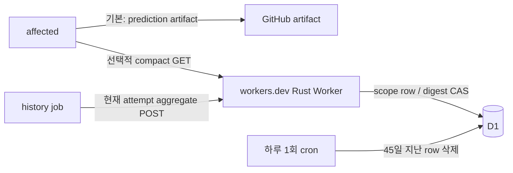

# 선택적 Nanoom History Worker — Cloudflare Workers + D1

상태: Rust Worker는 D1에 scope별 ModelState 한 행을 저장한다. Cloudflare Workers Free 계정을 확인하고 전용 D1 `nanoom-history-state` 및 schema를 만들었다. Worker는 [nanoom-history.giljongyudev.workers.dev](https://nanoom-history.giljongyudev.workers.dev)에 배포했다. Hosted `/health`와 `/ready`는 200이다. Actions에는 opt-in client가 구현됐고, Worker secret과 GitHub Actions secret을 exact repository/scope로 제한해 설정했다. 익명 protected snapshot은 401로 거부된다. 실제 hosted merge/warm reuse, CPU/사용량 검증은 아직 남았다. 기본 history 경로는 계속 GitHub artifact다. 데이터/알고리즘 기준은 [PredictionState v3](prediction-model-spec.md), HTTP 계약은 [OpenAPI](api/history.openapi.yaml)다.

## 1. 호스팅과 무료 한도

Cloudflare Workers Free는 하루 100,000 요청과 요청당 CPU 10ms를 제공한다. D1 무료 한도는 하루 500만 row read, 100,000 row write, 데이터베이스당 500 MB, 계정 전체 5 GB다. 무료 read/write 한도를 넘으면 쿼리가 실패하고 한도는 UTC 자정에 복구된다. Free의 한도에서 자동으로 유료 Worker로 승격하지 않는다. [Workers 가격/제한](https://developers.cloudflare.com/workers/platform/pricing/) · [D1 가격](https://developers.cloudflare.com/d1/platform/pricing/) · [D1 제한](https://developers.cloudflare.com/d1/platform/limits/).

D1 한 row 상한 2,000,000 bytes에 여유를 두고 Worker state는 1,900,000 bytes까지만 저장한다. Free DB 500 MB 또는 read/write 한도에 닿으면 저장/조회가 실패할 수 있으므로 계정 전체가 항상 무료로 무제한 동작한다고 보장하지 않는다. 한도 초과 요청은 실패하되 Workers Paid로 올리지 않는다. Workers CPU 10ms 제한도 실제 최대 state에서 확인해야 한다.

R2는 S3 호환 object storage이지만, 이 계정의 R2 시작 화면은 free allowance 초과 사용량의 자동 결제 구독과 약관 동의를 요구한다. 사용자는 $0 운영을 요청했으므로 R2 구독은 수락하지 않았다. 현재 대안인 D1은 SQL 저장소이며 S3 API 호환 저장소가 아니다. 향후 R2가 필요하면 자동 청구 조건을 별도로 합의해야 한다.

Worker 주소는 `workers.dev`를 사용한다. 사용자 도메인, DNS record, 카드 등록 없이 시작한다.

## 2. 사용자 경로와 API

- 기본은 artifact backend다. `scheduler: artifact`에서 사용자가 server를 opt-in하기 전에는 Worker에 요청하지 않는다. Action 입력으로 server backend를 opt-in한다.
- planner는 작은 PredictionTable만 GET한다. model state, 날짜 bucket, batch receipt, raw measurement는 공개 응답에 넣지 않는다.
- history job은 현재 attempt aggregate만 POST한다. fork PR에는 token을 주지 않고 artifact/cold 경로를 유지한다.
- planner의 전체 lookup/download/parse budget은 모든 scope 합계 3초다. 이력 오류는 warning/cold이며 기존 task 실패 조건을 바꾸지 않는다.
- Worker는 `/v1` 이력 API만 맡으며 `scheduler:http` coordinator의 queue/lease/run contract를 구현하지 않는다.

| Route | 권한 | 동작 |
|---|---|---|
| `GET /health` | 없음 | 저장소 호출 없는 liveness, 200 |
| `GET /ready` | 없음 | D1 `SELECT 1`, 성공 200 / 실패 503 |
| `GET /v1/repositories/{repositoryKey}/scopes/{scopeId}/snapshot` | exact read ACL | compact PredictionTable 200 / 304 / 유효 row 없음 404 |
| `POST /v1/repositories/{repositoryKey}/scopes/{scopeId}/observations:merge` | exact write ACL | 원자 병합 또는 duplicate receipt 200 |

API `/v1`, Plan v1, ModelState/PredictionTable v3는 독립 버전이다. Request body는 UTF-8 uncompressed JSON 최대 16 MiB며, D1에 저장되는 결과 ModelState는 1.9 MB 이하로 제한한다. 중복 JSON object key와 unknown typed fields를 거부한다. RFC9457 `application/problem+json` 응답은 request ID만 노출한다. 401에는 Bearer challenge, 503에는 `Retry-After`, 304에는 body가 없다.

## 3. 인증과 저장

Worker secret `NANOOM_AUTH_JSON`은 최대 5 KiB이며 repository alias와 principal별 exact read/write `(repositoryKey, scopeId)` ACL을 담는다. wildcard는 허용하지 않는다. Raw token은 최소 32-byte 난수며 Worker config에는 SHA-256 digest만 저장한다. GitHub에는 raw token을 `NANOOM_HISTORY_TOKEN` Actions secret으로 보관하며 저장소에 넣지 않는다. 현재 ACL은 이 repository의 E2E workflow scope 하나만 허용한다. Secret이 없거나 유효하지 않으면 protected route는 `configuration_error`로 닫힌다.

Scope ID는 공개 RFC8785 JCS(Scope)의 SHA-256이다. Repository alias는 GitHub API origin과 numeric repository ID에 고정한다. Raw ref/path는 storage key에 넣지 않으며 body run 정보는 GitHub 서명 증거가 아니다.

각 `(repositoryKey, scopeId)`는 D1의 한 row에 canonical ModelState JSON, SHA-256 digest, 갱신 시각을 보관한다. Read는 digest를 확인한 뒤 schema를 검증한다. Snapshot GET은 만료 bucket을 제외해 PredictionTable을 계산하고 D1을 변경하지 않는다. HTTP ETag는 그 public projection bytes의 SHA-256이며 저장 digest를 노출하지 않는다.

## 4. 동시 갱신과 보존

1. 인증/정확 scope ACL, body 크기, JSON schema, scope/batch/idempotency key, age와 aggregate를 저장소 read 전에 검증한다.
2. D1에서 state와 digest를 읽는다. 손상/버전 불일치를 빈 모델로 덮지 않는다.
3. 동일 `batchId`와 digest면 `applied=false`; 같은 ID의 다른 digest는 409다.
4. 공용 Rust `apply_batch`가 정수 daily count/sum, 최신 UTC 날짜, 7개 bucket, weighted prediction, receipt를 한 모델에 반영한다.
5. 같은 D1 row의 digest가 읽은 값과 일치할 때만 `UPDATE`한다. 새 row는 primary key 충돌 시 `INSERT OR IGNORE`가 한 요청만 이긴다. 경쟁에서 지면 최신 state를 다시 읽어 최대 8회 dedup/merge하고, 소진은 `503 cas_retries_exhausted`다.
6. state JSON 1,900,000 bytes, model key 또는 receipt cap을 넘으면 저장하지 않고 409를 반환한다. 살아 있는 receipt를 임의 제거하지 않는다.

Raw observation 배열은 저장하지 않는다. 최신 7 observed day와 최대 4096 batch receipt/8일을 보관하며 key/date bucket은 PredictionState v3 계약을 따른다. D1 row에는 `updated_at_ms` index가 있다. 매일 Worker cron이 마지막 갱신 후 45일 넘은 row를 최대 10,000개 삭제한다. 큰 backlog는 여러 날에 걸쳐 정리되며 정확한 cron 실행 시각을 보장하지 않는다.

## 5. 로컬 및 hosted 검증

| 단계 | 상태 |
|---|---|
| 공유 PredictionState core / Rust Worker API | D1 build/native tests/clippy 통과; 로컬 D1 HTTP contract 통과 |
| D1 schema / CAS / duplicate / concurrency / stale cleanup | local migration 및 merge/duplicate/conflict/concurrent CAS/scheduled cleanup 통과 |
| `/health`, `/ready`, exact auth, errors, ETag | local contract 통과; hosted `/health`·`/ready` 200, 익명 protected snapshot 401 |
| Cloudflare Workers Free + D1 + `workers.dev` | 배포 및 remote migration 완료; hosted authorized merge, CPU, usage는 미실시 |
| Actions opt-in client / cold fallback | 구현 및 local D1 E2E 통과; GitHub-hosted artifact transport는 미실시 |

계정 화면에서 Workers Free가 활성화되고 결제 수단은 등록되지 않은 상태를 확인했다. 전용 D1 DB `nanoom-history-state`를 만들고 `0001_initial.sql`을 적용했다. 기존 계정의 다른 D1 DB는 재사용하지 않는다. R2 구독/Worker Paid 전환은 하지 않았다. 2026-09-25에 `NANOOM_AUTH_JSON`을 한 repository/workflow scope ACL로 설정했다. 익명 snapshot 요청의 401 응답으로 auth config가 유효하고 unauthenticated access가 거부됨을 확인했으며 authorized merge는 hosted E2E에서 확인해야 한다.

배포 명령은 `worker-build --release`, `wrangler d1 migrations apply nanoom-history-state --remote`, `wrangler deploy` 순이다. 2026-09-24 배포의 Worker version ID는 `f4ea5fe3-06fa-4013-9e16-baee49006e76`이다. Hosted `/health`·`/ready`를 각각 HTTP 200으로 확인했다. 인증 secret 부재 상태에서 protected snapshot은 `configuration_error` 503을 반환해 닫혀 있는 것도 확인했다. `workers.dev` hostname을 사용하므로 DNS는 필요 없다.

Hosted 서버는 code/build/local test와 다른 증거다. 실제 Actions가 prediction을 읽고 쓰는지, warm run reuse, 전체 CI makespan, Worker CPU 10ms, free quota usage는 아직 측정하지 않았다. 이를 artifact/로컬 테스트 결과로 대신하지 않는다.

## 6. 참고

- [Workers pricing](https://developers.cloudflare.com/workers/platform/pricing/) · [Workers limits](https://developers.cloudflare.com/workers/platform/limits/) · [Rust Workers](https://developers.cloudflare.com/workers/languages/rust/)
- [D1 pricing](https://developers.cloudflare.com/d1/platform/pricing/) · [D1 limits](https://developers.cloudflare.com/d1/platform/limits/) · [Wrangler D1 configuration](https://developers.cloudflare.com/d1/wrangler-commands/)
- [RFC8785](https://www.rfc-editor.org/rfc/rfc8785) · [RFC9457](https://www.rfc-editor.org/rfc/rfc9457)
